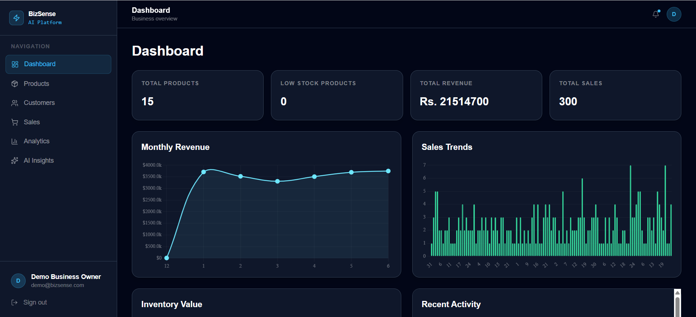
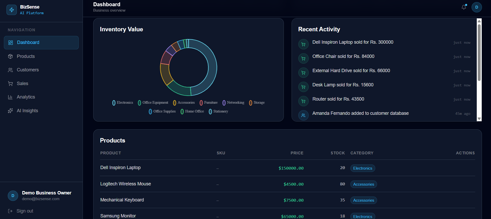
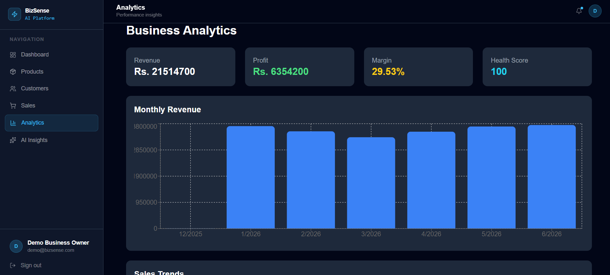
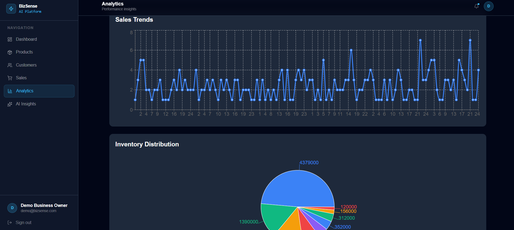
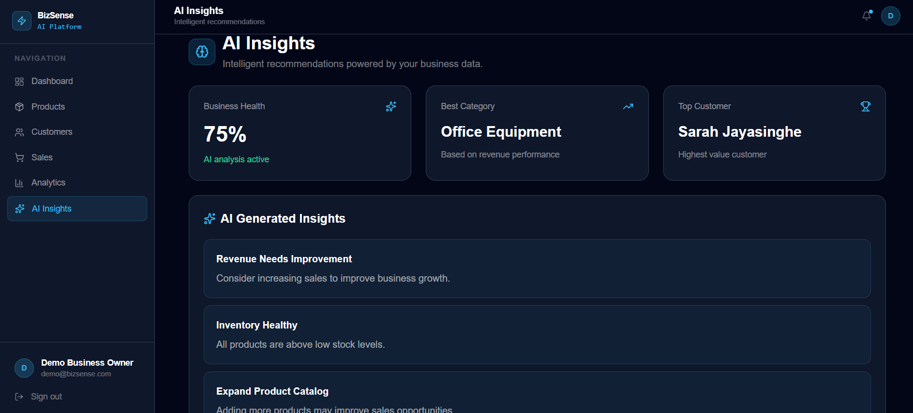
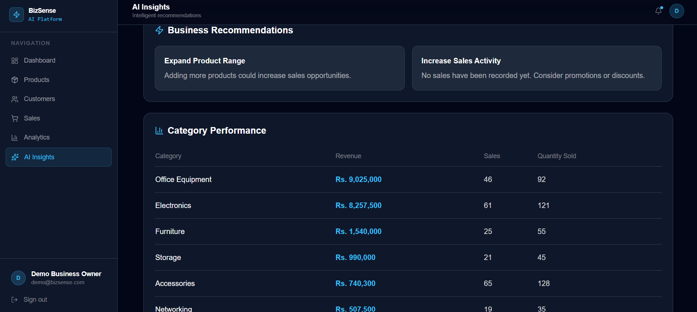
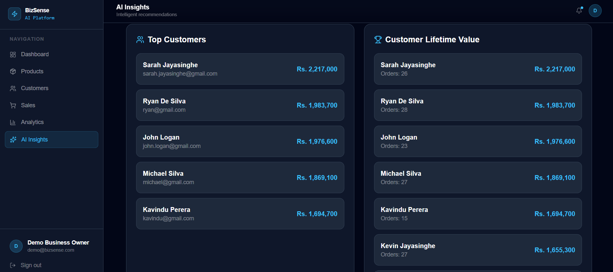

# BizSense AI

BizSense AI is an AI-powered business intelligence and operations platform designed for small and medium-sized businesses.

The platform helps businesses manage inventory, track sales, manage customer relationships, monitor business performance, and generate intelligent business insights through analytics.

---

## Project Overview

BizSense AI is a full-stack Business Intelligence and Operations Management platform built for small and medium-sized businesses.

The system enables businesses to manage inventory, customers, and sales while transforming operational data into actionable insights through analytics and AI-powered recommendations.

Unlike traditional inventory systems, BizSense AI combines operational management with business intelligence, allowing users to monitor performance, identify trends, evaluate business health, and make data-driven decisions.

The project demonstrates Full-Stack Development, Business Analytics, Data Engineering fundamentals, Cloud Deployment, and AI-driven insight generation.

---

## Live Demo

### Frontend

https://biz-sense-ai.vercel.app

### Backend API

https://bizsense-ai-production.up.railway.app

---

## Deployment

### Frontend

* Vercel

### Backend

* Railway

### Database

* MongoDB Atlas

---

## Features

### Authentication & Security

* User Registration
* User Login
* JWT Authentication
* Protected API Routes
* User-Specific Data Isolation

---

### Inventory Management

* Add Products
* View Products
* Update Products
* Delete Products
* Low Stock Monitoring
* Inventory Statistics
* Category-Based Inventory Analysis
* Inventory Value Tracking

---

### Customer Management

* Add Customers
* View Customers
* Update Customers
* Delete Customers
* Customer Purchase Tracking
* Customer-Sales Linking

---

### Sales Management

* Record Sales
* Automatic Inventory Deduction
* Sales History
* Sales Statistics
* Top Selling Products
* Profit Tracking

---

### Business Intelligence & Analytics

#### Dashboard Summary

* Total Products
* Low Stock Products
* Total Sales
* Total Revenue
* Inventory Value

#### Revenue Analytics

* Monthly Revenue Analytics
* Sales Trend Analytics

#### Inventory Analytics

* Inventory Value Analytics
* Category Performance Analytics

#### Customer Analytics

* Top Customers Analytics
* Customer Lifetime Value Analytics

#### Business Performance

* Business Health Score
* Profit Analytics
* Recent Activity Feed

#### AI-Powered Insights

* AI Business Insights
* Smart Business Recommendations
* Inventory Alerts
* Sales Performance Recommendations
* Customer Behavior Insights

---

## Demo Dataset

The deployed version currently contains realistic business data for demonstration purposes.

| Dataset   | Records |
| --------- | ------- |
| Products  | 15      |
| Customers | 14      |
| Sales     | 300     |

The dataset is used to demonstrate:

* Revenue Analytics
* Profit Analysis
* Customer Lifetime Value
* Top Customer Identification
* Inventory Intelligence
* AI Business Recommendations
* Business Health Scoring

---

## Technology Stack

### Frontend

* React.js
* Vite
* Tailwind CSS
* Axios
* React Router DOM
* Recharts
* Lucide React

### Backend

* Node.js
* Express.js

### Database

* MongoDB Atlas
* Mongoose

### Authentication

* JSON Web Tokens (JWT)
* bcryptjs

### API Testing

* Postman

### Deployment

* Vercel
* Railway

---

## Project Structure

```text
backend/
│
├── controllers/
│   ├── authController.js
│   ├── productController.js
│   ├── customerController.js
│   ├── saleController.js
│   └── dashboardController.js
│
├── middleware/
│   └── authMiddleware.js
│
├── models/
│   ├── User.js
│   ├── Product.js
│   ├── Customer.js
│   └── Sale.js
│
├── routes/
│   ├── authRoutes.js
│   ├── productRoutes.js
│   ├── customerRoutes.js
│   ├── saleRoutes.js
│   └── dashboardRoutes.js
│
├── server.js
└── .env

frontend/
│
├── src/
│   ├── pages/
│   ├── components/
│   ├── routes/
│   ├── context/
│   └── layouts/
│
├── App.jsx
├── main.jsx
└── .env
```

---

## API Endpoints

### Authentication

| Method | Endpoint           |
| ------ | ------------------ |
| POST   | /api/auth/register |
| POST   | /api/auth/login    |

### Products

| Method | Endpoint          |
| ------ | ----------------- |
| POST   | /api/products     |
| GET    | /api/products     |
| PUT    | /api/products/:id |
| DELETE | /api/products/:id |

### Customers

| Method | Endpoint           |
| ------ | ------------------ |
| POST   | /api/customers     |
| GET    | /api/customers     |
| GET    | /api/customers/:id |
| PUT    | /api/customers/:id |
| DELETE | /api/customers/:id |

### Sales

| Method | Endpoint                |
| ------ | ----------------------- |
| POST   | /api/sales              |
| GET    | /api/sales              |
| GET    | /api/sales/stats        |
| GET    | /api/sales/top-products |

### Dashboard Analytics

| Method | Endpoint                               |
| ------ | -------------------------------------- |
| GET    | /api/dashboard/summary                 |
| GET    | /api/dashboard/monthly-revenue         |
| GET    | /api/dashboard/sales-trends            |
| GET    | /api/dashboard/inventory-value         |
| GET    | /api/dashboard/business-health         |
| GET    | /api/dashboard/ai-insights             |
| GET    | /api/dashboard/recommendations         |
| GET    | /api/dashboard/category-performance    |
| GET    | /api/dashboard/top-customers           |
| GET    | /api/dashboard/profit-analytics        |
| GET    | /api/dashboard/customer-lifetime-value |
| GET    | /api/dashboard/activity-feed           |

---

## Installation

### Clone Repository

```bash
git clone https://github.com/Chamethya-dev/BizSense-AI.git
```

### Backend Setup

```bash
cd backend
npm install
```

Create a `.env` file:

```env
PORT=5000
MONGO_URI=your_mongodb_connection_string
JWT_SECRET=your_secret_key
```

Run Backend:

```bash
npm run dev
```

### Frontend Setup

```bash
cd frontend
npm install
```

Create a `.env` file:

```env
VITE_API_URL=http://localhost:5000/api
```

Run Frontend:

```bash
npm run dev
```

---

## Project Status

### Completed Modules

✅ Authentication Module

✅ Product Management Module

✅ Inventory Intelligence Module

✅ Customer Management Module

✅ Sales Management Module

✅ Dashboard Analytics Module

✅ Business Intelligence Module

✅ AI Insights Module

✅ Profit Analytics Module

✅ Customer Analytics Module

✅ Activity Tracking Module

✅ React Frontend Dashboard

✅ Railway Backend Deployment

✅ Vercel Frontend Deployment

✅ MongoDB Atlas Integration

---

## Current State

The application is fully functional and deployed.

Users can:

* Register and Login
* Manage Inventory
* Manage Customers
* Record Sales
* Track Revenue and Profit
* View Analytics Dashboards
* Receive AI-Generated Business Insights
* Monitor Business Health

---

## Screenshots

### Dashboard Overview



### Dashboard Analytics



---

### Product Management


---

### Customer Management


---

### Sales Management


---

### Business Analytics Overview



### Revenue & Inventory Analytics



---

### AI Insights Dashboard



### Customer Intelligence



### Category Performance Analytics


---

## Skills Demonstrated

### Software Engineering

* REST API Development
* Authentication & Authorization
* MVC Architecture
* Backend Development
* Frontend Development
* Database Design

### Data & Analytics

* Business Intelligence
* Revenue Analytics
* Profit Analytics
* Customer Analytics
* Inventory Analytics
* KPI Tracking

### Technologies

* React.js
* Node.js
* Express.js
* MongoDB
* JWT Authentication
* Railway
* Vercel

---

## Future Enhancements & Data Science Roadmap

### Business Forecasting

* Revenue Forecasting using Machine Learning
* Monthly Sales Prediction
* Demand Forecasting
* Inventory Consumption Forecasting

### Customer Intelligence

* Customer Segmentation
* Customer Churn Prediction
* Customer Value Classification
* Personalized Customer Recommendations

### Advanced AI Features

* AI Business Assistant
* Natural Language Business Queries
* OpenAI / Gemini Integration
* Automated Insight Generation

### Reporting & Automation

* PDF Report Generation
* CSV / Excel Export
* Automated Weekly Reports
* Email Notifications

### Enterprise Features

* Role-Based Access Control
* Multi-Business Support
* Supplier Management
* Invoice Management

---

## Author

Chamethya Palliyaguru

BSc (Hons) Data Science Undergraduate

SLIIT – Sri Lanka Institute of Information Technology

GitHub:
https://github.com/Chamethya-dev

---

## License

This project was developed for educational and portfolio purposes.
